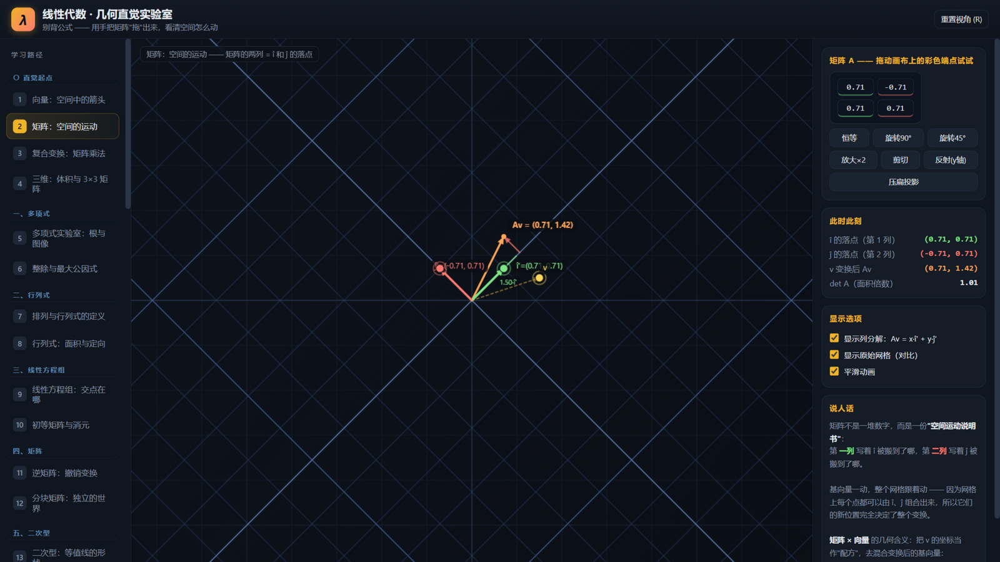
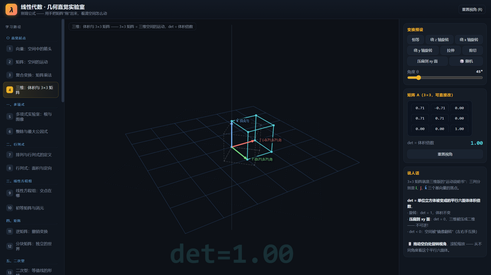
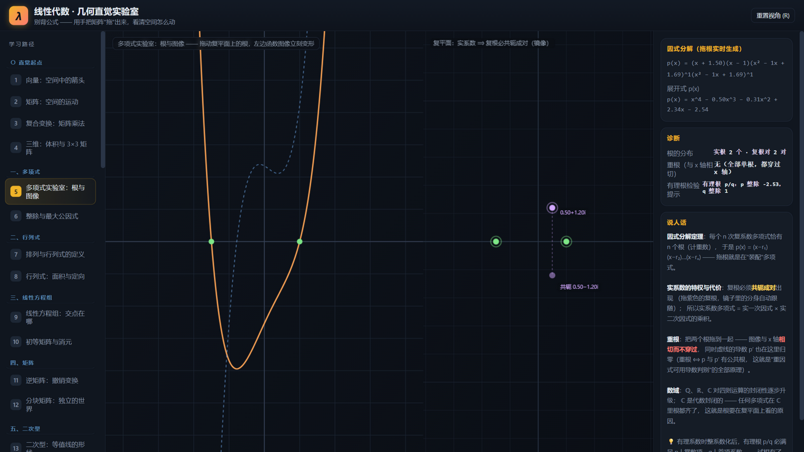

# 线性代数 · 几何直觉实验室

一个纯本地、零依赖的交互式学习网站：**用手把矩阵"拖"出来**，直观感受向量与矩阵在空间中如何变化，建立正确的几何直觉。章节结构参照北京大学《高等代数》教材组织，风格致敬 3Blue1Brown《线性代数的本质》与 matrixguts 的闯关模式。







## 特性

- 🖐️ **万物可拖**：向量端点、矩阵列、复平面上的根，拖动即改，空间实时变形
- 📚 **36 章 + 18 关**：覆盖北大《高等代数》全部主干（多项式 → 行列式 → 方程组 → 矩阵 → 二次型 → 线性空间 → 线性变换 → λ矩阵 → 欧氏空间 → 双线性与辛），外加 SVD 等现代视角
- 🎮 **18 关闯关**：从"送向量回家"到"指定奇异值"，每关一个亲手构造的矩阵任务，进度自动保存
- 🧊 **自研微型 3D 引擎**：无任何依赖的透视投影 + 画笔排序，立方体/网格变换拖转视角
- 📓 **每章配"说人话"**：右侧面板实时数值诊断 + 几何直觉解释
- 📴 **纯离线**：纯 Canvas 2D + 原生 JavaScript，无框架、无构建、无网络请求，双击即用

## 怎么打开

**方式一（最简单）**：直接双击 `index.html`（或 `打开网站.bat`），用浏览器打开即可。

**方式二（本地服务器）**：

```bash
cd 线性代数
python -m http.server 8642
# 浏览器访问 http://127.0.0.1:8642/
```

不需要安装任何东西，不需要联网。

## 章节结构（对照北大《高等代数》）

侧栏按教材章节分组，共 36 章。学习顺序 = 侧栏从上到下。

### 〇 直觉起点（先玩起来，建立核心图像）

| # | 章节 | 内容 |
|---|------|------|
| 1 | 向量：空间中的箭头 | 拖动金色端点，分量投影、平行四边形加法、k·v |
| 2 | 矩阵：空间的运动 | **核心章**：拖 î′、ĵ′ 编辑矩阵两列，网格实时变形；Av = x·î′ + y·ĵ′ 列分解 |
| 3 | 复合变换：矩阵乘法 | BA = 先 A 后 B；交换顺序验证 BA ≠ AB；det(BA) = detA·detB |

### 一、多项式

| # | 章节 | 内容 |
|---|------|------|
| 4 | 多项式实验室：根与图像 | 拖动复平面上的根（复根自动共轭成对镜像），左边函数图像实时变形；把两根拖重合看**相切**（重根）与导数共零点；因式分解/展开式实时生成 |
| 5 | 整除与最大公因式 | 可编辑系数的 f、g：带余除法 → **辗转相除**逐步表格 → 首一最大公因式；曲线上金点 = 公共根；数域封闭性说明 |

### 二、行列式

| # | 章节 | 内容 |
|---|------|------|
| 6 | 排列与行列式的定义 | 3×3 的 6 项逐项展示：**排列连线图**（交叉数=逆序数）、奇偶排列定符号、项的选取；按行展开与 Cramer 铺垫 |
| 7 | 行列式：面积与定向 | 单位正方形→平行四边形，det = 面积倍数；拖共线看"降维压扁"；负 det = 翻转 |

### 三、线性方程组

| # | 章节 | 内容 |
|---|------|------|
| 8 | 线性方程组：交点在哪 | 行视图交点 + 列视图配方；无穷解时展示**解的结构：通解 = 特解 + 齐次解**（过原点的核 vs 不过原点的解线）；无解/无穷解判别 |
| 9 | 初等矩阵与消元 | 三类行变换按钮：直线怎么变形，**交点（解）一动不动**；左乘初等矩阵 E、累计 P=Eₖ…E₁；求逆 [A\|I]→[I\|A⁻¹] 原理 |

### 四、矩阵

| # | 章节 | 内容 |
|---|------|------|
| 10 | 逆矩阵：撤销变换 | A⁻¹ 网格与 A 镜像对称；撤销动画 A→I→A⁻¹；v = A⁻¹b；奇异 = 不可逆 |
| 11 | 分块矩阵：独立的世界 | 3D 块三角结构：对角块 = 不变子空间解耦，耦合块让 z 轴歪掉；det/特征值按块拼装 |

### 五、二次型

| # | 章节 | 内容 |
|---|------|------|
| 12 | 二次型：等值线的形状 | q=xᵀAx 等值线族：椭圆(正定)/双曲线(不定)/平行线(半定)；主轴；标准型；拖点读 q(p) |

### 六、线性空间

| # | 章节 | 内容 |
|---|------|------|
| 13 | 子空间：过原点的封闭世界 | span 全平面↔直线切换；封闭性演示；"不过原点"反例 |
| 14 | 交与和 · 直和 | U+W、U∩W；唯一拆法 α·u+β·w；共线时拆法无穷多、直和失效 |
| 15 | 同构：不同的世界，同一套结构 | ℝ² ↔ ℂ 双世界联动；复数乘法 ↔ 矩阵 [[a,−b],[b,a]] |
| 16 | 基变换：换个坐标看世界 | 两套坐标读数、新基网格、分解走步；B⁻¹AB 相似对角化 |

### 七、线性变换

| # | 章节 | 内容 |
|---|------|------|
| 17 | 特征向量：不转向的箭头 | 云雾动画：只有特征方向原地伸缩；λ₁、λ₂ 实时；复特征值情形 |
| 18 | 值域与核 | 列空间 + 零空间实时；x 进核线 Ax 蒸发；rank + nullity = 2 |
| 19 | 不变子空间 | 拖探针找"出不去的方向"；一维不变子空间 = 特征方向 |
| 20 | Jordan 标准型 | [λ,b;0,λ] 双滑杆；J^k 剪切行进；**最小多项式**读数；换坐标看相似不变 |

### 八、λ矩阵与相似

| # | 章节 | 内容 |
|---|------|------|
| 21 | λ矩阵：不变因子的流水线 | λI−A → D₁/D₂ → 不变因子 → Smith → 有理标准型伴侣阵 |
| 22 | 相似判定 | 双矩阵叠加，迹/det/χ/不变因子逐项打勾判定 A∼B；纯量陷阱 |
| 23 | 四大关系：等价·相似·合同·正交相似 | 关系切换 + 随机 P/Q：不变量表（🔒标出理论保证项）、四种标准形、对称模式自动对称化 |

### 九、欧氏空间与酉空间

| # | 章节 | 内容 |
|---|------|------|
| 24 | 点积：投影乘长度 | 投影+垂线；正/零/负；\|a\|\|b\|cosθ |
| 25 | 叉积：垂直的新向量 | 3D 平行四边形有向面积；右手定则；a×b = −b×a |
| 26 | 欧氏空间：线性空间 + 内积 | 左右分屏：线性世界"问不出角度" vs 欧氏世界全都有 |
| 27 | Gram-Schmidt：造标准正交基 | 分步动画：单位化 → 减投影 → 再单位化；斜基炼成直基 |
| 28 | 正交变换：欧氏世界的同构 | 旋转/反射/拉伸对照；单位圆不变性；QᵀQ=I 体检 |
| 29 | 正交补与投影 | W⊥、正交分解 x = proj + x⊥、到子空间的距离（最小二乘原理） |
| 30 | 实对称矩阵：正交对角化 | 谱定理动画 A = QΛQᵀ；特征方向垂直的直角标记；非对称对照 |
| 31 | 酉空间：复数版的内积 | ⟨u,v⟩ = u·v̄ 共轭对称；酉变换保内积 |

### 十、双线性函数与辛空间

| # | 章节 | 内容 |
|---|------|------|
| 32 | 线性函数与对偶空间 | 左 V 右 V*：拖对偶向量 a，水平线族实时旋转/变密 |
| 33 | 双线性函数：两个槽的机器 | B(u,v)=uᵀAv；对称/反对称/一般；固定 u 退化为线性函数 |
| 34 | 辛空间：面积守护者 | ω = 有向面积；剪切保面积（辛✓）vs 拉伸破坏（✗） |

### 现代视角（教材外补充）

| # | 章节 | 内容 |
|---|------|------|
| 35 | SVD：旋转·拉伸·旋转 | 三步分解动画；单位圆→椭圆；σ₁σ₂；秩1压扁 |

### 实战

| # | 章节 | 内容 |
|---|------|------|
| 36 | 闯关挑战 | 18 道关卡：基础 6 关（送向量回家 / 面积翻六倍 / 降维打击 / 照镜子 / 制造特征向量 / 完美旋转）+ 进阶 12 关（幂零 / 投影 / 对合 / 与旋转可交换 / 指定特征值 / 亏损 Jordan / 正交反射 / 各向同性放大 / 谱定理实战 / 正交投影 / 保面积 SL(2) / 指定奇异值）；进度自动保存 |

## 操作

- 🟡 **拖动金色/彩色端点** —— 改变向量或矩阵的列（核心交互）
- 拖动空白处 —— 平移视角（3D 章节为旋转视角）
- 滚轮 —— 缩放；按 **R** 或点"重置视角"复位
- 右侧面板 —— 精确输入、预设、开关动画

## 文件结构

```
index.html      页面骨架
style.css       样式（暗色主题）
js/core.js      数学工具 / 相机（2D+3D）/ Canvas 绘图原语 / UI 组件
js/scenes1.js   向量 / 矩阵即变换 / 行列式
js/scenes2.js   复合变换 / 特征值 / 三维
js/scenes3.js   线性方程组 / 逆矩阵 / 二次型
js/scenes4.js   基变换 / 分块矩阵 / 二次型等值线
js/scenes5.js   SVD / 子空间 / 交与和·直和 / 同构
js/scenes6.js   值域与核 / 不变子空间 / Jordan 标准型
js/scenes7.js   λ矩阵与不变因子 / 相似判定
js/scenes8.js   欧氏空间 / 正交变换 / 正交补 / 谱定理 / 酉空间
js/scenes9.js   线性函数与对偶空间 / 双线性函数 / 辛空间
js/scenes10.js  四大关系：等价 / 相似 / 合同 / 正交相似
js/scenes11.js  多项式实验室 / 整除与gcd / 排列与行列式 / 初等矩阵 / Gram-Schmidt
js/puzzles.js   闯关模式
js/main.js      应用外壳（分组导航 / 画布事件 / 渲染循环）
```

纯 Canvas 2D + 原生 JavaScript，无任何框架、无构建步骤、无网络请求。
